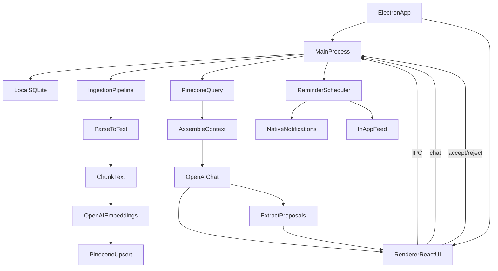

## Personal file-aware desktop agent (detailed plan)

## Goals
- Desktop app where you can **upload/index files** and then **chat with context** (RAG).
- MVP “catch”: the agent can **suggest reminders / next actions**, but they are **user-confirmed** before scheduling.
- **Notifications**: in-app announcements feed + **native desktop notifications**.

## Non-goals (explicitly deferred)
- Multi-device sync of chat history / reminders.
- Collaborative sharing / team workspaces.
- Fully autonomous reminders without user confirmation.
- OCR for images/scans (add later).
- Complex calendar integrations (Google Calendar, Apple Calendar) in v1.

## Decisions (locked)
- **App identity**: name `Bestfriend`, bundle id `com.bestfriend`, package name `bestfriend`.
- **Repo layout**: pnpm workspaces monorepo (pnpm enabled via `corepack` — no global install).
- **Start mode**: scaffolding first with **stub providers**; real OpenAI / Pinecone keys wired in Settings when available.
- **Desktop stack**: Electron + TypeScript + React.
- **Build tooling**: `electron-vite` + `electron-builder` (fast HMR, simple config).
- **App shape**: regular dock app **plus** a small floating quick-capture window summoned by a global `⌘⇧Space` hotkey, **plus** a minimal tray icon (single click → quick-capture; right-click → status + quit). The capture window writes to an Inbox.
- **Anchor job**: "project brain" — a folder becomes a Collection you can chat with as the project's expert. Onboarding lands here.
- **Daily rhythm**: quick-capture is the primary surface; deep sessions are occasional. Inbox is where captures land for triage.
- **Renderer state**: TanStack Query for IPC-backed data, `zustand` for local UI state.
- **Local DB**: SQLite via `better-sqlite3`.
- **Secrets**: Electron `safeStorage` (OS keychain-backed).
- **Hosted LLM**: OpenAI (chat + embeddings + audio transcription).
- **Vector DB**: Pinecone (hosted), app **auto-creates** the index with the correct embedding dimension.
- **Namespaces**: `docs` (file chunks) and `chat_history` (past message chunks).
- **Ingestion UX**: drag/drop files + choose folders to index; audio files transcribed then indexed.
- **Voice input**: push-to-talk in chat composer (uses transcription provider).
- **Proactivity**: **reactive only** — proposals are produced as part of chat replies; no background scanning of new files.
- **Proposal mechanism**: OpenAI **tool/function calls** (`propose_reminder`, `propose_suggestion`, `remember_about_user`) with strict JSON schemas. No text-delimiter parsing.
- **Personalization**: user profile + auto-memory layer (model can record memories; user can edit/delete in Settings).
- **Reminders**: one-off + simple recurrence (daily / weekly / monthly) + snooze (10m / 1h / tomorrow).
- **Scoping**: Collections (manual, multi-tag) — chat composer can scope to one or more collections.
- **Chat UX**: streaming responses by default; sources drawer per assistant message.
- **Spend guardrails**: pre-action $ estimate (require confirm above threshold) + per-day soft cap that pauses jobs.
- **Delivery**: in-app feed + native desktop notifications.

## Prereqs (before first run)
- Create an OpenAI API key at platform.openai.com and add a small budget there.
- Create a Pinecone account and project; get an API key.
  - The app will auto-create the index using the dimension matching the chosen embeddings model.

## Success criteria (what “done” means)
- You can drag/drop a set of docs, see them indexed, and ask questions whose answers cite the uploaded sources.
- The assistant can propose reminders; you can accept them; they reliably fire even after app restart.
- Folder indexing works for incremental refresh (reindex changed files; skip unchanged).
- Audio files can be transcribed and then used as RAG context.

## High-level architecture


## Project layout (detailed)
This layout is optimized for Electron safety (renderer cannot touch secrets/FS) and for testability.

- `apps/desktop/`
  - `src/main/`
    - `main.ts` (create window, app lifecycle)
    - `ipc/` (IPC handlers)
    - `jobs/` (job runner + progress events)
    - `notifications/` (native notification wrapper)
    - `scheduler/` (timer management, sleep/wake handling)
  - `src/preload/`
    - `index.ts` (expose `window.api`)
  - `src/renderer/`
    - `routes/Library.tsx`, `Chat.tsx`, `Feed.tsx`, `Settings.tsx`
    - `components/` (dropzone, sources drawer, proposal cards)
    - `state/` (query cache/store)
- `packages/core/` (pure logic; no Electron)
  - `ingest/` parsers and normalizers
  - `rag/` chunker, context assembly, citation formatting
  - `providers/openai/` OpenAI client wrappers
  - `providers/pinecone/` Pinecone client wrappers
  - `domain/` types: Document, Chunk, Message, Proposal, Reminder
  - `util/` hashing, mime detection, token estimation

## Security model (Electron-specific)
- **Renderer**: UI only; no filesystem access; no API keys; no direct network calls.
- **Preload**: exposes a narrow API surface, validated + typed.
- **Main**: holds secrets (from secure storage), does network calls to OpenAI/Pinecone, and does filesystem ingestion.
- **Logging**: redact keys and chunk text by default (log identifiers + sizes instead).

## IPC contract (the API you build first)
Implement these as typed IPC endpoints; the renderer calls them via `window.api.*`.

- Library / indexing
  - `pickFolder(): Promise<string | null>`
  - `addFolderIndex(path: string): Promise<{ indexId: string }>`
  - `scanFolder(indexId: string): Promise<{ jobId: string }>`
  - `dropFiles(paths: string[]): Promise<{ jobId: string }>`
  - `listDocuments(): Promise<DocumentSummary[]>`
  - `removeDocument(documentId: string): Promise<void>`
  - `reindexDocument(documentId: string): Promise<{ jobId: string }>`
  - `jobEvents(jobId: string): AsyncIterable<JobEvent>` (or push events)
- Chat
  - `listConversations(): Promise<ConversationSummary[]>`
  - `createConversation(): Promise<{ conversationId: string }>`
  - `sendMessage(conversationId: string, text: string): Promise<AssistantTurn>`
- Proposals
  - `listProposals(conversationId: string): Promise<Proposal[]>`
  - `acceptProposal(proposalId: string): Promise<void>`
  - `rejectProposal(proposalId: string): Promise<void>`
- Reminders / feed
  - `listReminders(): Promise<Reminder[]>`
  - `listFeedItems(): Promise<FeedItem[]>`
  - `markFeedRead(feedItemId: string): Promise<void>`
- Inbox + quick-capture
  - `quickCaptureText(text: string): Promise<{ inboxItemId: string }>`
  - `quickCaptureVoice(audioPath: string): Promise<{ inboxItemId: string }>` (transcribes then stores)
  - `listInbox(): Promise<InboxItem[]>`
  - `triageInboxItem(id: string, action: { type: 'reminder' | 'note' | 'chat' | 'dismiss', payload?: unknown }): Promise<void>`
  - `openCaptureWindow(): Promise<void>` (also bound to global `⌘⇧Space`)
- Settings
  - `getSettings(): Promise<Settings>`
  - `setSettings(patch: Partial<Settings>): Promise<Settings>`
  - `testConnections(): Promise<{ openaiOk: boolean; pineconeOk: boolean; errors: string[] }>`

## Persistence (SQLite) detailed schema
Use SQLite for deterministic local state. Treat Pinecone as “derived index” that can be rebuilt.

- `documents`
  - `id` (uuid)
  - `source_type` (`drop` | `file` | `folder` | `audio`)
  - `source_uri` (path)
  - `display_name`
  - `mime_type`
  - `sha256`
  - `bytes`
  - `indexed_at`
  - `last_seen_at`
  - `status` (`indexed` | `indexing` | `error`)
  - `error_message`
- `chunks`
  - `id` (uuid)
  - `document_id`
  - `chunk_index`
  - `chunk_text`
  - `token_count_estimate`
  - `pinecone_vector_id`
  - `created_at`
- `folder_indexes`
  - `id` (uuid)
  - `path`
  - `include_globs_json`
  - `exclude_globs_json`
  - `last_scan_at`
- `collections`
  - `id` (uuid)
  - `name` (unique)
  - `color` (optional, for UI)
  - `created_at`
- `document_collections` (join)
  - `document_id`
  - `collection_id`
  - PK (`document_id`, `collection_id`)
- `conversations`
  - `id` (uuid)
  - `title`
  - `scope_collection_ids_json` (which collections this chat is scoped to; null = all)
  - `created_at`
  - `updated_at`
- `messages`
  - `id` (uuid)
  - `conversation_id`
  - `role`
  - `content`
  - `created_at`
  - `retrieval_trace_json`
  - `pinecone_vector_id` (nullable; set when embedded into `chat_history` namespace)
- `proposals`
  - `id` (uuid)
  - `message_id`
  - `type` (`reminder` | `suggestion`)
  - `payload_json`
  - `status` (`proposed` | `accepted` | `rejected`)
  - `created_at`
  - `decided_at`
- `reminders`
  - `id` (uuid)
  - `title`
  - `notes`
  - `due_at` (next fire time)
  - `timezone`
  - `recurrence` (`one_off` | `daily` | `weekly` | `monthly`)
  - `status` (`scheduled` | `fired` | `cancelled`)
  - `snoozed_until` (nullable)
  - `eventkit_id` (nullable; the corresponding macOS Reminders item, if mirroring is enabled)
  - `created_at`
  - `fired_at`
- `feed_items`
  - `id` (uuid)
  - `type` (`announcement` | `reminder_fired` | `index_error`)
  - `title`
  - `body`
  - `created_at`
  - `read_at`
- `inbox_items` (quick-capture triage queue)
  - `id` (uuid)
  - `kind` (`text` | `voice`)
  - `raw_text` (typed input)
  - `transcript` (for voice captures)
  - `audio_path` (nullable; original audio file for voice captures)
  - `status` (`untriaged` | `actioned` | `dismissed`)
  - `suggested_action_json` (agent's pre-classification: type + payload + confidence)
  - `actioned_as` (`reminder` | `note` | `chat` | `dismiss`, nullable)
  - `actioned_target_id` (id of the created reminder/conversation/note, nullable)
  - `created_at`
  - `actioned_at` (nullable)
- `user_profile` (single row)
  - `name`, `role`, `timezone`, `tone_preferences`, `current_projects_json`, `updated_at`
- `memories` (auto-memory layer)
  - `id` (uuid)
  - `content` (one short fact about the user)
  - `source_message_id` (nullable)
  - `pinned` (bool)
  - `created_at`
  - `deleted_at` (nullable; soft-delete so the model doesn't re-add)
- `usage_ledger` (for spend guardrails)
  - `id` (uuid)
  - `provider` (`openai` | `pinecone`)
  - `kind` (`embed` | `chat` | `transcribe` | `vector_op`)
  - `tokens_in`, `tokens_out` (nullable)
  - `units` (nullable; e.g. seconds for transcription)
  - `est_cost_usd`
  - `occurred_at`

## Pinecone index design (detailed)
- **Index**: one serverless index, dimension matches embedding model (e.g. 1536 for `text-embedding-3-small`).
- **Auto-create**: app creates the index on first launch if missing.
- **Namespaces**:
  - `docs` — file/document chunks
  - `chat_history` — message chunks for long-term recall across conversations
- **Vector id**:
  - docs: `chunk::<chunkId>`
  - chat_history: `msg::<messageId>` (or per-chunk if a message is long)
- **Metadata (docs)**: `chunk_id`, `document_id`, `chunk_index`, `filename`, `source_uri`, `mime_type`, `sha256`, `text`, `collection_ids` (array).
- **Metadata (chat_history)**: `message_id`, `conversation_id`, `role`, `created_at`, `text`.
- **Filtering**:
  - Per-chat scope: filter `docs` by `collection_ids` if the conversation is scoped.
  - Optional filter for date ranges in `chat_history`.
- **Deletion**:
  - Removing a document → delete its chunk vectors.
  - Removing a conversation → delete its message vectors.
  - Strategy: store `document_id` / `conversation_id` in metadata for delete-by-filter; also keep authoritative list in SQLite.

## OpenAI usage (detailed)
### Default model knobs (all configurable in Settings)
- Embeddings: `text-embedding-3-small` (dim 1536).
- Chat: configurable GPT model.
- Transcription: configurable.
- Streaming: chat responses stream token-by-token to the renderer.

### Tools the chat model can call
- `propose_reminder({ title, due_at, timezone, recurrence, notes, confidence })`
- `propose_suggestion({ title, details, confidence })`
- `remember_about_user({ content, reason })`
- (Optional, later) `search_collection({ query, collection_ids, k })` for explicit retrieval

The renderer never trusts free-form text for proposals. Only tool-call payloads create proposals/memories.

### Spend guardrails
- Track every API call in `usage_ledger` with an estimated USD cost (computed locally from token counts and a price table in Settings).
- Pre-action **estimates**: indexing a folder shows "≈ N chunks, ≈ $X to embed" and requires confirm above a configurable threshold.
- **Per-day soft cap**: when reached, queue paused and a feed item explains why.
- Hard caps:
  - max files per indexing batch
  - max chunks per document
  - max tokens per chat context

## Ingestion pipeline (step-by-step, build order)
### Step A: file type support matrix (MVP)
- **Text**: `.txt`, `.md`
- **Docs**: `.pdf`, `.docx`
- **Audio**: `.m4a`, `.mp3`, `.wav` (transcribe)

### Step B: canonical “DocumentText” representation
Every ingested thing becomes:
- `documentId`
- `displayName`
- `sourceUri`
- `mimeType`
- `fullText`
- `optional: pageMap` (for PDFs) or `sectionMap`

### Step C: chunking algorithm (MVP deterministic)
- Normalize whitespace.
- Split into candidate paragraphs.
- Merge paragraphs until near `targetChunkTokens`.
- Add overlap by carrying last N tokens into next chunk.
- Persist each chunk before embedding.

### Step D: embeddings + upsert
- For each chunk:
  - call embeddings
  - upsert vector to Pinecone with metadata including the chunk text
  - write `pinecone_vector_id`

### Step E: incremental folder indexing (MVP)
- Scan folder; for each supported file:
  - compute `sha256`
  - if unchanged vs stored `sha256`, skip
  - else reindex (delete old vectors, insert new chunks)

### Step F: audio transcription ingestion
- Transcribe audio → treat transcript as `fullText`.
- Index transcript as normal.

## RAG chat flow (step-by-step, build order)
### Step 1: embed query
- embed user message.
### Step 2: Pinecone query (multi-namespace)
- Query `docs` namespace: topK_docs (default 10).
  - If conversation is scoped, filter by `collection_ids`.
- Query `chat_history` namespace: topK_chat (default 5).
- Merge + de-dup; keep best by score.
### Step 3: context assembly
- Build a "Sources" block grouping by source type:
  - Documents: `[doc:filename#chunkIndex]`
  - Past chats: `[chat:conversationTitle@date]`
- Hard cap total context tokens.
### Step 4: chat call (with tools + streaming)
- Provide:
  - system prompt (includes user profile + active memories)
  - sources block
  - conversation history (last N turns)
  - tool definitions (`propose_reminder`, `propose_suggestion`, `remember_about_user`)
- Stream tokens to renderer.
- On tool calls: persist them as proposals/memories (proposals stay `proposed` until accepted).
- Persist assistant message + retrieval trace.
### Step 5: embed assistant + user messages into `chat_history`
- After each turn, embed the new messages and upsert to the `chat_history` namespace for future retrieval.

## Proposals (reminders/suggestions) (detailed)
### Output contract — tool calls (no text parsing)
The model produces proposals only via OpenAI tool calls, with strict JSON schemas. The renderer never parses free-form text for proposals.

### Tool: `propose_reminder`
```json
{
  "type": "object",
  "required": ["title", "due_at", "timezone", "recurrence", "confidence"],
  "properties": {
    "title": { "type": "string" },
    "due_at": { "type": "string", "description": "ISO 8601 local datetime (no offset)" },
    "timezone": { "type": "string", "description": "IANA tz, e.g. Europe/Helsinki" },
    "recurrence": { "enum": ["one_off", "daily", "weekly", "monthly"] },
    "notes": { "type": "string" },
    "confidence": { "type": "number", "minimum": 0, "maximum": 1 }
  }
}
```

### Tool: `propose_suggestion`
```json
{
  "type": "object",
  "required": ["title", "confidence"],
  "properties": {
    "title": { "type": "string" },
    "details": { "type": "string" },
    "confidence": { "type": "number", "minimum": 0, "maximum": 1 }
  }
}
```

### Tool: `remember_about_user`
```json
{
  "type": "object",
  "required": ["content", "reason"],
  "properties": {
    "content": { "type": "string", "description": "One short fact about the user" },
    "reason": { "type": "string", "description": "Why this is worth remembering" }
  }
}
```

### UI acceptance rule (MVP)
- Only show proposals with `confidence >= threshold` (default 0.6, configurable).
- All proposals are inert until user accepts.
- Accepting a reminder opens a small confirm dialog with editable title/time/recurrence.
- Memories appear in Settings (list, edit, pin, delete). Deleted memories are soft-deleted so the model is told "do not re-record this".

## Reminder scheduler + notifications (detailed)
### Scheduling rules
- Store reminders in SQLite with `timezone` and `recurrence`.
- Convert `due_at + timezone` into an absolute timestamp.
- On app start:
  - load all `scheduled` reminders (and snoozed ones whose `snoozed_until` has passed).
  - set timers.
- On sleep/wake:
  - run catch-up: if reminder fire time passed and still scheduled, fire now.
- After firing a recurring reminder:
  - compute next `due_at` (daily/weekly/monthly) and schedule it.

### macOS Reminders mirroring (locked)
- When enabled in Settings, every accepted reminder is also written to a configurable list in macOS Reminders (default list name: `Bestfriend`).
- Mechanism: small Swift helper bundled with the app (or `osascript` wrapper), called from the main process.
- Two-way sync is **out of MVP**; we only push from Bestfriend → Reminders. Marking done in macOS Reminders does NOT close the Bestfriend reminder (we surface this caveat in Settings).
- `reminders.eventkit_id` stores the created identifier so future "edit" / "cancel" can update the macOS item.
- If permission is denied, mirroring silently disables and a Feed item explains how to grant access.

### Snooze behavior
- Snooze actions on a fired notification: `10 minutes`, `1 hour`, `Tomorrow 9am`.
- Snooze sets `snoozed_until` and re-arms the timer.

### Notification behavior
- Native notification shows `title` and a short `notes` snippet, with action buttons (Snooze / Done).
- Always also write a `feed_items` row so missed notifications are recoverable.

## UI build spec (detailed)
### Library screen
- Dropzone + "Add folder" button.
- Document list with status (indexed / indexing / error), chunk count, last indexed.
- Per-document actions: reindex, remove, manage collections.
- Collections sidebar: create/rename/delete; click to filter list.
- Pre-action confirm dialog when projected cost exceeds threshold.

### Chat screen
- Conversation list (left) + chat area (right).
- New chat: collection scope selector (multi-select; "All" by default).
- Composer:
  - text area
  - push-to-talk mic button (voice → transcription → fills composer)
- Streaming assistant responses.
- Sources drawer per assistant message: shows retrieved doc chunks AND retrieved past-chat snippets, each with score.
- Proposals UI:
  - cards rendered from tool-call payloads
  - Accept / Reject buttons
  - Accept reminder → small dialog to edit title/time/recurrence before saving
- Inline "Memories captured" indicator if the model called `remember_about_user`.

### Feed screen
- Unified list for reminders fired + indexing announcements + spend-cap notices.
- Per-item actions: Done / Snooze (for reminders), Mark read.

### Settings screen
- **Profile**: name, role, timezone, tone preferences, current projects.
- **Memories**: list, edit, pin, delete (soft-delete) auto-captured memories.
- **API keys**: OpenAI, Pinecone (stored via `safeStorage`).
- **Models**: embeddings, chat, transcription.
- **Retrieval**: topK_docs, topK_chat, chunk size/overlap.
- **Spend**: per-day cap (USD), pre-action confirm threshold, current daily spend.
- **Privacy**: "Wipe all data" (drops local SQLite + clears both Pinecone namespaces).
- **Connectivity**: "Test connections" with actionable errors and an "Auto-create Pinecone index" button.

## Implementation milestones (very explicit, with deliverables)
### Milestone 0: Bootstrap + navigation
- `electron-vite` scaffold; main / preload / renderer set up.
- Routes: Library / Chat / Feed / Settings.
- Typed IPC bridge wired end-to-end (one no-op call working).

### Milestone 1: Settings + secrets + connectivity
- Settings page persists profile + keys via `safeStorage`.
- "Test connections" verifies OpenAI + Pinecone.
- Auto-create Pinecone index button works.

### Milestone 2: Indexing (txt/md) + collections
- Drag/drop and "Add folder" → parse → chunk → embed → upsert to `docs` namespace.
- Collections CRUD; assign documents to collections; `collection_ids` written to Pinecone metadata.
- Pre-action cost estimate + confirm dialog.
- `usage_ledger` records every call.

### Milestone 3: RAG chat with streaming + scoping
- Conversations + messages persisted.
- Multi-namespace retrieval (`docs` + `chat_history`), with collection filter.
- Streaming responses; sources drawer.
- Embed past messages into `chat_history` after each turn.

### Milestone 4: Proposals + memories via tool calls
- Define `propose_reminder`, `propose_suggestion`, `remember_about_user` tools with strict schemas.
- Tool-call payloads create proposals/memories rows.
- Accept reminder → confirm dialog → `reminders` row.
- Memories visible/editable in Settings.

### Milestone 5: Reminder scheduler + notifications
- Schedule on app start; recurrence handling; sleep/wake catch-up.
- Native notifications with Snooze / Done actions.
- Feed entries on fire.

### Milestone 6: Folder indexing incremental + spend cap enforcement
- sha256-based skip; reindex changed; remove deleted (orphaned) entries.
- Per-day spend cap pauses jobs and posts a feed item.

### Milestone 7: PDF/DOCX + audio transcription + voice input
- Parsers for `.pdf`, `.docx`.
- Audio file ingestion → transcript → indexed.
- Push-to-talk in chat composer.

### Milestone 8: Quick-capture + Inbox
- Floating capture window + global `⌘⇧Space` hotkey + tray icon.
- Voice + text capture; transcription path reused.
- Inbox route with triage actions (reminder / note / chat / dismiss).
- Lightweight pre-classification call on capture for suggested triage.

### Milestone 9: macOS Reminders mirroring
- Settings toggle + list selector + permission flow.
- Helper to create / update / cancel EventKit reminders.

### Milestone 10: Onboarding + Polish
- 5-step first-run flow optimized for the project-brain anchor.
- "Wipe all data".
- Error states across Library/Chat/Inbox.
- Empty states with onboarding hints.

## Detailed Todo List

### Phase 0 — Bootstrap + Navigation
- [x] Enable `corepack` and scaffold pnpm workspaces monorepo (`apps/desktop`, `packages/core`)
- [x] Init `apps/desktop` with `electron-vite` template; configure TypeScript strict mode
- [x] Set up `packages/core` as a separate TypeScript package with its own `tsconfig.json`
- [x] Configure monorepo-level `pnpm-workspace.yaml` and root `package.json` scripts
- [x] Install and configure `electron-builder` (macOS DMG target, `com.bestfriend` bundle id)
- [x] Set up `BrowserWindow` with `titleBarStyle: 'hiddenInset'`, correct CSP headers
- [x] Define initial domain types in `packages/core/domain/`: `Document`, `Chunk`, `Message`, `Proposal`, `Reminder`, `FeedItem`, `InboxItem`, `Settings`
- [x] Create typed `WindowApi` interface in `packages/core/domain/ipc.ts` (all IPC endpoints)
- [x] Implement `apps/desktop/src/preload/index.ts` — expose `window.api` via `contextBridge` only
- [x] Wire a single no-op IPC round-trip (e.g. `ping/pong`) to verify bridge works end-to-end
- [x] Scaffold renderer React app with `react-router-dom`: routes for `/library`, `/chat`, `/feed`, `/settings`
- [x] Build persistent sidebar layout component (220 px, vibrancy, Phosphor Icons, active state)
- [x] Add SF Pro, Instrument Serif, and Geist Mono fonts (bundled, no runtime fetch)
- [x] Set up TanStack Query `QueryClient` provider and Zustand store boilerplate
- [x] Verify `pnpm --filter @bestfriend/desktop dev` starts with HMR and no console errors

### Phase 1 — Settings + Secrets + Connectivity
- [x] Design and implement `Settings` SQLite table + `user_profile` single-row table (migration 001)
- [x] Implement `safeStorage` wrapper in main process for OpenAI and Pinecone keys
- [x] Implement `getSettings` / `setSettings` IPC handlers (validate all fields in main)
- [x] Build Settings renderer screen: Profile section (name, role, timezone, tone, current projects)
- [x] Build Settings renderer section: API Keys (OpenAI, Pinecone) — inputs write via IPC, never stored in renderer state
- [x] Build Settings renderer section: Models (embeddings model, chat model, transcription model)
- [x] Build Settings renderer section: Retrieval knobs (topK_docs, topK_chat, chunk size, overlap)
- [x] Build Settings renderer section: Spend (per-day cap USD, pre-action confirm threshold display)
- [x] Implement `testConnections` IPC handler — verify OpenAI API key and Pinecone API key independently
- [x] Implement Pinecone client wrapper in `packages/core/providers/pinecone/` (create index if missing)
- [x] Implement OpenAI client wrapper in `packages/core/providers/openai/` (stub-safe, key optional)
- [x] Build "Test connections" UI button with per-service status pills and actionable error messages
- [x] Build "Auto-create Pinecone index" button (with dimension derived from selected embeddings model)
- [x] Initialize `usage_ledger` SQLite table (migration 002) with write helper

### Phase 2 — Indexing (txt/md) + Collections
- [x] Implement `documents`, `chunks`, `folder_indexes`, `collections`, `document_collections` SQLite tables (migration 003)
- [x] Implement text/markdown parser in `packages/core/ingest/` → `DocumentText` canonical representation
- [x] Implement chunking algorithm in `packages/core/rag/chunker.ts` (paragraph merge + overlap)
- [x] Implement token estimation utility in `packages/core/util/tokens.ts`
- [x] Implement embeddings batch helper in `packages/core/providers/openai/embeddings.ts`
- [x] Implement Pinecone upsert with metadata in `packages/core/providers/pinecone/upsert.ts`
- [x] Implement `dropFiles` IPC handler — accepts file paths, starts ingestion job, returns `jobId`
- [x] Implement job runner in `apps/desktop/src/main/jobs/` — queue, progress events, error handling
- [x] Emit `jobEvents` progress IPC stream (file count, chunks indexed, estimated cost so far)
- [x] Write `usage_ledger` entries for every embeddings API call
- [x] Implement SHA-256 hasher in `packages/core/util/hash.ts`
- [x] Implement `listDocuments` IPC handler returning `DocumentSummary[]`
- [x] Implement `removeDocument` IPC handler — soft-delete SQLite rows + delete Pinecone vectors
- [x] Implement `reindexDocument` IPC handler — recompute chunks, re-embed, upsert
- [x] Implement Collections CRUD: `createCollection`, `renameCollection`, `deleteCollection`, `assignDocumentToCollection`
- [x] Build Library renderer screen: file/folder dropzone (react-dropzone), document list with status badges
- [x] Build document list item with chunk count, last-indexed timestamp, per-row action menu
- [x] Build Collections sidebar panel: list, create/rename/delete, click-to-filter list
- [x] Build pre-action cost-estimate confirm dialog (shows "≈ N chunks, ≈ $X")
- [x] Subscribe to `jobEvents` stream in renderer; show per-document progress bar
- [x] Build `addFolderIndex` + `pickFolder` IPC handlers; wire "Add folder" button
- [x] Implement `scanFolder` IPC handler (enumerate files, filter by globs, start ingestion jobs)
- [x] Add per-day spend-cap check in job runner (pause queue and post feed item when exceeded)

### Phase 3 — RAG Chat with Streaming + Scoping
- [x] Implement `conversations` and `messages` SQLite tables (migration 004)
- [x] Implement `listConversations` / `createConversation` IPC handlers
- [x] Implement Pinecone multi-namespace query helper in `packages/core/providers/pinecone/query.ts`
- [x] Implement context assembly in `packages/core/rag/context.ts` (merge, de-dup, cap tokens, build Sources block)
- [x] Implement `sendMessage` IPC handler — full RAG pipeline (embed query → retrieve → assemble → stream chat)
- [x] Implement OpenAI streaming chat call in `packages/core/providers/openai/chat.ts`
- [x] Stream tokens to renderer via IPC push channel; accumulate in renderer without re-renders on every token
- [x] Persist assistant message + `retrieval_trace_json` to SQLite after stream completes
- [x] Embed user + assistant messages and upsert to `chat_history` Pinecone namespace after each turn
- [x] Write `usage_ledger` entries for every chat API call (tokens in + out + estimated cost)
- [x] Build Chat renderer screen: conversation list sidebar (left 280 px) + chat area (right flex)
- [x] Build chat message list with streaming token rendering (Instrument Serif prose, Geist Mono code)
- [x] Build chat composer: resizable textarea, send on Enter/Shift+Enter, disabled while streaming
- [x] Build Sources drawer: slide-in panel per assistant message, shows doc chunks + past-chat snippets with scores
- [x] Build collection scope selector in new-conversation flow (multi-select chips, "All" default)
- [x] Handle `chat_history` namespace filter in retrieval when conversation is scoped

### Phase 4 — Proposals + Memories via Tool Calls
- [x] Define strict JSON schemas for `propose_reminder`, `propose_suggestion`, `remember_about_user` tools in `packages/core/rag/tools.ts`
- [x] Wire tool definitions into the `sendMessage` OpenAI call
- [x] Implement tool-call payload parser/validator in main process (reject malformed calls, log violations)
- [x] Implement `proposals` and `memories` SQLite tables (migration 005)
- [x] Write proposal rows from tool-call payloads (`proposed` status, confidence stored)
- [x] Write memory rows from `remember_about_user` calls; inject active memories into system prompt
- [x] Implement `listProposals`, `acceptProposal`, `rejectProposal` IPC handlers
- [x] Build ProposalCard component (confidence badge, title, details, Accept/Reject buttons)
- [x] Build Accept Reminder confirm dialog (editable title, date/time picker, recurrence selector)
- [x] Build "Memories captured" inline indicator in assistant message when memories were recorded
- [x] Build Settings > Memories section: list all memories with edit, pin, soft-delete
- [x] Inject soft-deleted memory IDs into system prompt ("do not re-record") on every chat call
- [x] Apply confidence threshold gate: only render proposals with `confidence >= threshold`

### Phase 5 — Reminder Scheduler + Notifications
- [ ] Implement `reminders` and `feed_items` SQLite tables (migration 006)
- [ ] Implement reminder scheduler in `apps/desktop/src/main/scheduler/`: load on app start, set timers
- [ ] Handle sleep/wake events (`powerMonitor`) — run catch-up for missed fire times on resume
- [ ] Implement recurrence computation (daily/weekly/monthly next `due_at`) after firing
- [ ] Implement native notification dispatch using Electron's `Notification` API
- [ ] Add Snooze (10 min / 1 hr / tomorrow 9 am) and Done action buttons to notifications
- [ ] Write `feed_items` row on every reminder fire (so missed notifications are recoverable)
- [ ] Implement `listReminders` IPC handler (returning upcoming + snoozed)
- [ ] Implement `listFeedItems` / `markFeedRead` IPC handlers
- [ ] Build Feed renderer screen: unified list (reminder fired, indexing events, spend-cap notices)
- [ ] Build Feed item component with per-type icon, Snooze/Done actions for reminder-fired items
- [ ] Add unread pill badge to Feed nav item (count of unread `feed_items`)

### Phase 6 — Folder Indexing Incremental + Spend Cap Enforcement
- [ ] Extend `scanFolder` to compute SHA-256 per file and compare against stored `sha256` in `documents`
- [ ] Skip unchanged files; reindex changed files (delete old vectors, re-embed new chunks)
- [ ] Detect and handle deleted files: orphan documents marked `removed`, vectors deleted from Pinecone
- [ ] Surface scan summary in Library (N new, N updated, N removed, N skipped)
- [ ] Harden per-day spend cap: check cap before every job step (not just on job start)
- [ ] Post a `spend_cap` `feed_items` row when cap is hit; include current spend + cap amount
- [ ] Add "Resume today" override button in Feed for spend-cap notices
- [ ] Build Settings > Spend section: show current daily spend, reset time, usage breakdown by kind

### Phase 7 — PDF / DOCX + Audio Transcription + Voice Input
- [ ] Implement PDF parser in `packages/core/ingest/pdf.ts` using `pdf-parse` or `pdfjs-dist`; preserve pageMap
- [ ] Implement DOCX parser in `packages/core/ingest/docx.ts` using `mammoth`; preserve sectionMap
- [ ] Add PDF and DOCX to ingestion pipeline file-type dispatch
- [ ] Implement audio ingestion handler: detect audio MIME, call Whisper transcription, store transcript as fullText
- [ ] Implement OpenAI Whisper wrapper in `packages/core/providers/openai/transcribe.ts`
- [ ] Write `usage_ledger` entries for transcription (units = seconds, estimated cost)
- [ ] Wire `quickCaptureVoice` IPC path to reuse the Whisper wrapper
- [ ] Build push-to-talk mic button in chat composer: hold to record, release to transcribe, transcript fills textarea
- [ ] Add audio file to MIME detection utility (`packages/core/util/mime.ts`)
- [ ] Show transcription-in-progress spinner in composer while Whisper call is pending

### Phase 8 — Quick-Capture + Inbox
- [ ] Create quick-capture `BrowserWindow`: 480×240, frameless, `vibrancy: 'hud'`, always-on-top, 96 px from screen top
- [ ] Register global `⌘⇧Space` hotkey to toggle capture window (`globalShortcut`)
- [ ] Set up system tray icon: left-click → open capture window; right-click → context menu (status + quit)
- [ ] Implement `openCaptureWindow` IPC handler; also callable from renderer
- [ ] Implement `inbox_items` SQLite table (migration 007)
- [ ] Implement `quickCaptureText` IPC handler (store to `inbox_items`, trigger lightweight pre-classification)
- [ ] Implement `quickCaptureVoice` IPC handler (transcribe then store, trigger pre-classification)
- [ ] Implement lightweight pre-classification call (small GPT call: returns suggested triage action + confidence)
- [ ] Build quick-capture renderer: text input, mic button (voice), submit shortcut (Enter)
- [ ] Implement `listInbox` / `triageInboxItem` IPC handlers
- [ ] Build Inbox route in renderer: list of untriaged items, per-item triage action buttons (Reminder / Note / Chat / Dismiss)
- [ ] Wire triage actions: `reminder` → create reminder dialog; `chat` → open new conversation with capture text pre-filled; `dismiss` → mark dismissed
- [ ] Show `suggested_action_json` hint on each inbox card; let user override

### Phase 9 — macOS Reminders Mirroring
- [ ] Add Settings toggle for Reminders mirroring + list-name text field
- [ ] Implement EventKit helper: write a small Swift CLI (or `osascript` wrapper) for create/update/cancel Reminders
- [ ] Bundle helper binary with `electron-builder` `extraResources`
- [ ] Implement permission request flow (EventKit entitlement); handle denial gracefully
- [ ] Call helper from main process on `acceptProposal` when mirroring is enabled; store returned `eventkit_id`
- [ ] Implement update path: if reminder is snoozed or cancelled, update the macOS Reminders item
- [ ] Post a `feed_items` row if permission is denied explaining how to grant access
- [ ] Add caveat note in Settings that marking done in macOS Reminders does not close Bestfriend reminder

### Phase 10 — Onboarding + Polish
- [ ] Design and build 5-step first-run onboarding flow (welcome → API keys → create first Collection → add a folder → send first message)
- [ ] Detect first launch (empty `documents` table) and route to onboarding
- [ ] Implement "Wipe all data" action: drop SQLite, clear both Pinecone namespaces, clear `safeStorage` keys
- [ ] Add confirmation dialog (type "DELETE" to confirm) for "Wipe all data"
- [ ] Build empty states for Library (no docs), Chat (no conversations), Feed (no items), Inbox (nothing to triage)
- [ ] Build full error states across Library (indexing error), Chat (API error, offline), Inbox (transcription error)
- [ ] Add motion transitions (Motion/react, spring `{ stiffness: 320, damping: 32 }`, `prefers-reduced-motion` guard)
- [ ] Audit all BrowserWindow configs and IPC handlers against electron-security skill checklist
- [ ] Verify `packages/core` has zero Electron imports (`tsc --noEmit` + grep)
- [ ] Run `pnpm tsc --noEmit` across all packages; fix all type errors
- [ ] Build final macOS `.dmg` with `electron-builder` and smoke-test on a clean machine

---

## Test plan (detailed)
- **Indexing correctness**:
  - index a folder with 10 docs; verify SQLite chunk count equals Pinecone vector count for that document.
- **RAG quality**:
  - ask 5 questions whose answers exist in docs; verify citations map to real chunks.
- **Reminder reliability**:
  - accept reminder due in 1 minute; verify notification.
  - restart app; verify reminder still fires.
  - simulate sleep (close lid) and resume; verify catch-up.
- **Error handling**:
  - invalid keys → clear Settings error
  - Pinecone index missing → guided message

## Failure modes + mitigations
- **Pinecone outage / network down**: queue jobs; allow retry; surface in Library.
- **OpenAI quota exceeded**: stop job; show error; keep partial progress; suggest raising platform limit.
- **Spend cap reached**: pause queued jobs; explain in Feed; offer "Resume today" override.
- **Embedding-model dim mismatch with index**: detect on first call; offer to re-create index (with confirm — destructive).
- **Large file**: refuse with clear limit message; suggest splitting.
- **Parser failure**: mark document error, keep it listed, allow retry.
- **Hallucinated reminders**: tool-call gate + confidence threshold + editable confirmation dialog.
- **Tool-call schema violation**: reject the tool call, log it, surface a small "model misbehaved" note in the message.
- **Memory pollution**: deleted memories are soft-deleted; system prompt instructs the model not to re-record them.
- **Privacy**: "Wipe all data" deletes SQLite, both Pinecone namespaces, and local logs.

