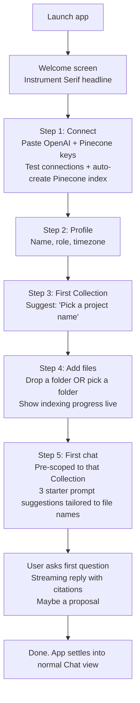
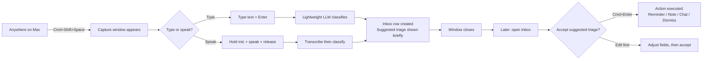
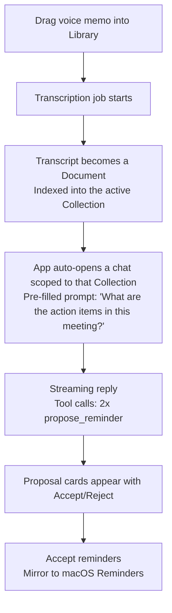
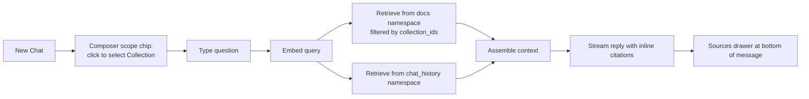
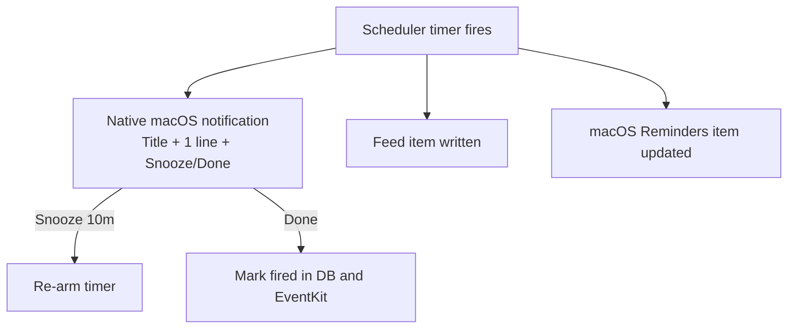

## Bestfriend — user stories, jobs-to-be-done, and end-to-end flows

Companion to `personal-agent-plan.md` and `personal-agent-design.md`. This document captures **why** someone opens Bestfriend, what they expect to accomplish, and the concrete flows that get them there.

## Persona (MVP audience of one, designed extensible)
**You** — a self-employed / IC professional who:
- accumulates a lot of personal documents (notes, PDFs, voice memos, project docs).
- already uses ChatGPT-like tools but is annoyed that they don't know your context.
- wants the agent to act *with* you, not *for* you (every action is user-confirmed).
- works on macOS, lives in a few different projects in parallel.
- prefers fewer, well-designed tools over many generic ones.

## Value proposition (one sentence)
Bestfriend is a desktop AI agent that knows your files, remembers what matters about you, and turns scattered thinking into clean reminders and notes — without ever acting behind your back.

## Differentiation
- vs **ChatGPT / Claude**: knows your files; can capture and remind; lives natively on your Mac.
- vs **Notion AI**: not document-centric, conversation-centric; reminders integrated; runs locally with your keys.
- vs **Apple Reminders / Things**: understands the *why* behind a reminder because it lives next to your docs and chats.
- vs **Obsidian + plugins**: out-of-the-box AI flow; native Mac feel; no plugin assembly required.

## Anchor job (locked)
**Project brain** — "Add a folder for one project, then chat with it as the project's expert."

Everything in onboarding optimizes for: install → connect → create your first project Collection → drop a folder → first useful answer with citations → first reminder accepted.

## Jobs-to-be-done (top 5, locked from grilling)
| # | Job | Trigger | "Done" feels like |
|---|-----|---------|-------------------|
| 1 | Project brain | Starting/picking up a project | Asked a real project question, got a cited answer |
| 2 | Find / recall in docs | "What did I write about X?" | Found the right doc + chunk, no manual searching |
| 3 | Process meetings & voice memos | Just finished a meeting | Voice memo turned into 1–3 accepted reminders |
| 4 | Personal assistant nudges | Wrote a commitment in a doc | Got reminded at the right time |
| 5 | Journal-style review | End of day / week | Surfaced patterns and a couple of follow-ups |

Quick-capture is the surface that connects daily life to all of these.

## Top user stories

### S1 — As a project person, I want to scope a chat to a project so I get focused answers.
- I create a Collection "Acme Redesign".
- I drag the project folder into the Library and assign it to that Collection.
- In Chat, I create a new conversation scoped to "Acme Redesign".
- I ask "what did the client say about the homepage hero?" — answer cites two Acme docs.

### S2 — As a meeting-haver, I want to drop a voice memo and get reminders.
- After a meeting I drop the voice memo on Bestfriend.
- It transcribes, indexes, and proposes 2 reminders ("Send Lisa the pricing doc by Friday").
- I accept both with one click each. They appear in Feed and macOS Reminders.

### S3 — As a thought-haver, I want to capture an idea in 2 seconds.
- I'm in another app. I press `⌘⇧Space`. A small window appears.
- I type "remember to draft the kickoff doc for Acme tomorrow" and hit enter.
- Window closes. The capture lands in Inbox with a suggested triage: "→ Reminder · Tomorrow 9am".
- Later I open Inbox, hit `↵` to accept the suggestion. Reminder created. Inbox empty.

### S4 — As a journal-er, I want to chat about my week and surface follow-ups.
- I open a "Daily" conversation.
- I tell it about my week.
- It quietly captures a couple of `remember_about_user` memories ("user is preparing for X conference in June").
- It proposes one reminder ("Block 1h Friday for conference deck"). I accept.

### S5 — As a careful person, I want to never be surprised by what the agent did.
- All proposals require accept.
- All memories are visible/editable in Settings → Memories.
- All API spend is visible in Settings → Spend with a per-day cap.
- "Wipe all data" really wipes both local DB and Pinecone namespaces.

### S6 — As a Mac user, I want my reminders to reach my phone.
- In Settings I enable "Mirror to macOS Reminders" and pick the list.
- Every accepted reminder also appears in macOS Reminders → syncs to iPhone via iCloud.

### S7 — As a returning user, I want to find old conversations by topic.
- I ask "what did we discuss about onboarding flow?"
- The agent retrieves from both `docs` and `chat_history` namespaces; sources drawer shows past chats.

## End-to-end flows

### Flow A — First run (onboarding) [optimized for project-brain anchor]

Key decisions in onboarding:
- Reduce keys-paste friction with "Paste both keys" affordance and obvious Pinecone "Auto-create index" button.
- Don't make Profile feel like a form — three short fields, optional except timezone.
- "Skip and explore" exit is available from Step 3 onwards.
- The starter prompt suggestions must reference real filenames from the just-indexed folder ("Summarize what `kickoff.md` covers").

### Flow B — Daily quick-capture loop

### Flow C — Process a meeting voice memo

### Flow D — Project chat with retrieval scoping

### Flow E — Reminder fires (with mirroring on)

## Onboarding copy (draft, can iterate)
- **Welcome**: "Hi. I'm Bestfriend. Let's set you up in five small steps."
- **Connect**: "Bring your own keys. Nothing leaves your Mac without you."
- **Profile**: "What should I call you, and what's your role? It helps me sound like myself for you."
- **First collection**: "Most people start with one project. What's its name?"
- **Add files**: "Drag a folder. I'll read it once and remember the parts that matter."
- **First chat**: "Ask me something about [project]. Try one of these:" (auto-generated suggestions).

## Empty states (with clear next action)
- **Inbox empty**: "Nothing to triage. Press `⌘⇧Space` anywhere to capture a thought."
- **Library empty**: "Drop a folder or files to start. Or skip — chat works without files too."
- **Chat empty**: "What's on your mind?" + 3 suggested prompts derived from current Collection.
- **Feed empty**: "Quiet. New reminders and announcements will appear here."

## Anti-stories (things we deliberately won't do in MVP)
- "I want the agent to send emails / book meetings / make calls on my behalf." (No autonomous side effects.)
- "I want to invite my teammates." (Single-user.)
- "I want it to learn from everything on my computer automatically." (No background scanning; opt-in only.)
- "I want it to work without my own API keys." (BYO-keys for cost transparency.)
- "I want a phone app." (Desktop only; iCloud-synced macOS Reminders is the bridge.)

## Success metrics (informal, for self-evaluation)
- Time from install to first cited answer: **< 10 minutes**.
- Quick-capture round trip (open → type → close): **< 5 seconds**.
- Inbox triage time per item: **< 8 seconds**.
- "Surprise factor" — number of times the agent does something user didn't expect/approve: **0**.
- After two weeks of use: at least **3 active Collections**, **20+ accepted reminders**, **inbox processed daily**.

## Risks to address in design
- **Onboarding cliff**: keys + Pinecone setup is genuinely the hardest moment. Mitigate with auto-create + plain-language errors + a "Need a hand?" link.
- **Capture friction**: if `⌘⇧Space` doesn't open in <150ms, people stop using it. Pre-warm the window in the main process.
- **Inbox neglect**: if untriaged piles up it becomes a guilt list. Tray badge + sidebar count + gentle "Inbox has 12 items from this week" feed item if neglected for 3+ days.
- **Reminder mistrust**: if even one bad reminder gets created without confirmation, trust collapses. Confidence threshold + always-confirm + visible memories.
